

---

## 🧬 Player Profile

> **"I'm Nguyễn Tiến Dũng** — an ICT undergraduate at **USTH (University of Science and Technology of Hanoi)**. I focus on **AI / ML engineering** across **Computer Vision**, **NLP**, and **Generative AI** — turning ideas into reproducible pipelines and shippable demos."

**Portfolio · CV · Projects →** [**nguyen-tien-dung.vercel.app**](https://nguyen-tien-dung.vercel.app/)

---

## ⚔️ System Window

<!-- AWAKEN:START -->
<!-- Generated by git-profile-awaken. Edit awaken.json instead of this block. -->

<picture><source media="(prefers-color-scheme: dark)" srcset="awaken/banner-dark.svg"><source media="(prefers-color-scheme: light)" srcset="awaken/banner-light.svg"></picture>

<picture><source media="(prefers-color-scheme: dark)" srcset="awaken/hunter-dark.svg"><source media="(prefers-color-scheme: light)" srcset="awaken/hunter-light.svg"></picture>

<picture><source media="(prefers-color-scheme: dark)" srcset="awaken/status-dark.svg"><source media="(prefers-color-scheme: light)" srcset="awaken/status-light.svg"></picture>

<picture><source media="(prefers-color-scheme: dark)" srcset="awaken/arsenal-dark.svg"><source media="(prefers-color-scheme: light)" srcset="awaken/arsenal-light.svg"></picture>

<picture><source media="(prefers-color-scheme: dark)" srcset="awaken/achievements-dark.svg"><source media="(prefers-color-scheme: light)" srcset="awaken/achievements-light.svg"></picture>

<picture><source media="(prefers-color-scheme: dark)" srcset="awaken/activity-dark.svg"><source media="(prefers-color-scheme: light)" srcset="awaken/activity-light.svg"></picture>

<picture><source media="(prefers-color-scheme: dark)" srcset="awaken/quest-dark.svg"><source media="(prefers-color-scheme: light)" srcset="awaken/quest-light.svg"></picture>
<picture><source media="(prefers-color-scheme: dark)" srcset="awaken/skills-dark.svg"><source media="(prefers-color-scheme: light)" srcset="awaken/skills-light.svg"></picture>

<picture><source media="(prefers-color-scheme: dark)" srcset="awaken/contribution-dark.svg"><source media="(prefers-color-scheme: light)" srcset="awaken/contribution-light.svg"></picture>
<picture><source media="(prefers-color-scheme: dark)" srcset="awaken/combat-dark.svg"><source media="(prefers-color-scheme: light)" srcset="awaken/combat-light.svg"></picture>

<picture><source media="(prefers-color-scheme: dark)" srcset="awaken/hours-dark.svg"><source media="(prefers-color-scheme: light)" srcset="awaken/hours-light.svg"></picture>
<picture><source media="(prefers-color-scheme: dark)" srcset="awaken/daily-dark.svg"><source media="(prefers-color-scheme: light)" srcset="awaken/daily-light.svg"></picture>

<picture><source media="(prefers-color-scheme: dark)" srcset="awaken/bio-dark.svg"><source media="(prefers-color-scheme: light)" srcset="awaken/bio-light.svg"></picture>
<a href="https://nguyen-tien-dung.vercel.app/"><picture><source media="(prefers-color-scheme: dark)" srcset="awaken/career-dark.svg"><source media="(prefers-color-scheme: light)" srcset="awaken/career-light.svg"></picture></a>

<a href="https://github.com/Dung092005/chatbot_deep_research"><picture><source media="(prefers-color-scheme: dark)" srcset="awaken/spotlight-1-dark.svg"><source media="(prefers-color-scheme: light)" srcset="awaken/spotlight-1-light.svg"></picture></a>
<a href="https://github.com/Dung092005/Rag_pipeline_chatbot_luat_lao_dong"><picture><source media="(prefers-color-scheme: dark)" srcset="awaken/spotlight-2-dark.svg"><source media="(prefers-color-scheme: light)" srcset="awaken/spotlight-2-light.svg"></picture></a>

<a href="https://github.com/Dung092005/Discord_Study_Copilot"><picture><source media="(prefers-color-scheme: dark)" srcset="awaken/spotlight-3-dark.svg"><source media="(prefers-color-scheme: light)" srcset="awaken/spotlight-3-light.svg"></picture></a>
<a href="https://github.com/Dung092005/Cloud-Fraud-Detection-Platform-on-AWS-"><picture><source media="(prefers-color-scheme: dark)" srcset="awaken/spotlight-4-dark.svg"><source media="(prefers-color-scheme: light)" srcset="awaken/spotlight-4-light.svg"></picture></a>

<picture><source media="(prefers-color-scheme: dark)" srcset="awaken/oracle-dark.svg"><source media="(prefers-color-scheme: light)" srcset="awaken/oracle-light.svg"></picture>

<a href="https://nguyen-tien-dung.vercel.app/"><picture><source media="(prefers-color-scheme: dark)" srcset="awaken/contact-1-website-dark.svg"><source media="(prefers-color-scheme: light)" srcset="awaken/contact-1-website-light.svg"></picture></a>
<a href="https://github.com/Dung092005"><picture><source media="(prefers-color-scheme: dark)" srcset="awaken/contact-2-github-dark.svg"><source media="(prefers-color-scheme: light)" srcset="awaken/contact-2-github-light.svg"></picture></a>
<a href="mailto:dung09122005@gmail.com"><picture><source media="(prefers-color-scheme: dark)" srcset="awaken/contact-3-email-dark.svg"><source media="(prefers-color-scheme: light)" srcset="awaken/contact-3-email-light.svg"></picture></a>
<a href="https://nguyen-tien-dung.vercel.app/"><picture><source media="(prefers-color-scheme: dark)" srcset="awaken/cv-dark.svg"><source media="(prefers-color-scheme: light)" srcset="awaken/cv-light.svg"></picture></a>

<picture><source media="(prefers-color-scheme: dark)" srcset="awaken/rune-str-dark.svg"><source media="(prefers-color-scheme: light)" srcset="awaken/rune-str-light.svg"></picture>
<picture><source media="(prefers-color-scheme: dark)" srcset="awaken/rune-agi-dark.svg"><source media="(prefers-color-scheme: light)" srcset="awaken/rune-agi-light.svg"></picture>
<picture><source media="(prefers-color-scheme: dark)" srcset="awaken/rune-int-dark.svg"><source media="(prefers-color-scheme: light)" srcset="awaken/rune-int-light.svg"></picture>
<picture><source media="(prefers-color-scheme: dark)" srcset="awaken/rune-vit-dark.svg"><source media="(prefers-color-scheme: light)" srcset="awaken/rune-vit-light.svg"></picture>

<picture><source media="(prefers-color-scheme: dark)" srcset="awaken/rune-luk-dark.svg"><source media="(prefers-color-scheme: light)" srcset="awaken/rune-luk-light.svg"></picture>
<picture><source media="(prefers-color-scheme: dark)" srcset="awaken/rune-cha-dark.svg"><source media="(prefers-color-scheme: light)" srcset="awaken/rune-cha-light.svg"></picture>

<!-- AWAKEN:END -->

---

## 🛠️ Tech Stack

<table>
<tr>
<td align="center" width="90"> <b>Python</b></td>
<td align="center" width="90"> <b>PyTorch</b></td>
<td align="center" width="90"> <b>TensorFlow</b></td>
<td align="center" width="90"> <b>NumPy</b></td>
<td align="center" width="90"> <b>OpenCV</b></td>
<td align="center" width="90"> <b>FastAPI</b></td>
<td align="center" width="90"> <b>Docker</b></td>
<td align="center" width="90"> <b>AWS</b></td>
</tr>
<tr>
<td align="center" width="90"> <b>React</b></td>
<td align="center" width="90"> <b>Node.js</b></td>
<td align="center" width="90"> <b>TypeScript</b></td>
<td align="center" width="90"> <b>C</b></td>
<td align="center" width="90"> <b>C++</b></td>
<td align="center" width="90"> <b>Java</b></td>
<td align="center" width="90"> <b>Git</b></td>
<td align="center" width="90"> <b>Linux</b></td>
</tr>
</table>

Full list on my <a href="https://nguyen-tien-dung.vercel.app/">portfolio</a>.

---

## 🏆 Project Highlights

| Quest | Loot | Result |
|:---:|:---|:---:|
| 🧠 **NeuralChat** | RAG + LLM · Pinecone | **92%** answer relevance |
| 👁️ **VisionScan** | YOLOv8 · TensorRT · real-time detection | **45 FPS** · **89%** mAP |
| ⚙️ **AutoML Pipeline** | MLflow · experiment tracking | **−60%** prototyping time |
| 🎙️ **DeepVoice Studio** | Vietnamese TTS | **MOS 4.1** / 5.0 |

For demos, stack and write-ups → [**nguyen-tien-dung.vercel.app**](https://nguyen-tien-dung.vercel.app/)

---

## 🐍 Contribution Snake

<picture>
  <source media="(prefers-color-scheme: dark)" srcset="https://raw.githubusercontent.com/Dung092005/Dung092005/output/github-contribution-grid-snake-dark.svg" />
  
</picture>

---

Widgets drawn nightly from real GitHub data by <a href="https://github.com/billtruong003/git-profile-awaken">Git Profile Awaken</a> · Theme: Solo Leveling

